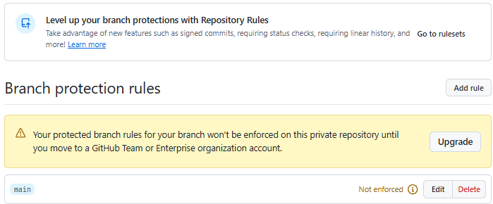

# Лабораторная работа №2. Git Flow, Code Review.

## Этапы выполнения работы

### Подготовка репозитория

Ранее уже создал папку с struct_LAB, добавил lab1, lab2.

файл [.gitignore](https://git-scm.com/book/ru/v2) отвечает за игнорирование файлов.

Добавил файл .gitignore, прописал команду `\build`, которая позволяет не отслеживать файлы сборки.

### Защита веток

1. Прочитал [документацию](https://docs.github.com/en/repositories/configuring-branches-and-merges-in-your-repository/managing-protected-branches/managing-a-branch-protection-rule) защиты веток на GitHub.
2. попытался защитить ветку, но для приватного рпеозитиория вылезла  
пришлось сделать репозиторий приватным
3. при попытке запушить появилась ошибка: 
```
remote: error: GH006: Protected branch update failed for refs/heads/main.
! [remote rejected] main -> main (protected branch hook declined)
error: failed to push some refs to 'github.com:Artemka19777/STRPO.git' 
```
4. удалил коммит `git reset --soft HEAD~1`, `soft` позволяет сохранить изменения, `hard` бы вернул меня в состояние предыдщего коммита.
5. `git checkout -b pr-test` - создал новую ветку, сделал коммит.`git push -u origin pr-test` запушил ветку в удаленный репозитиорий.