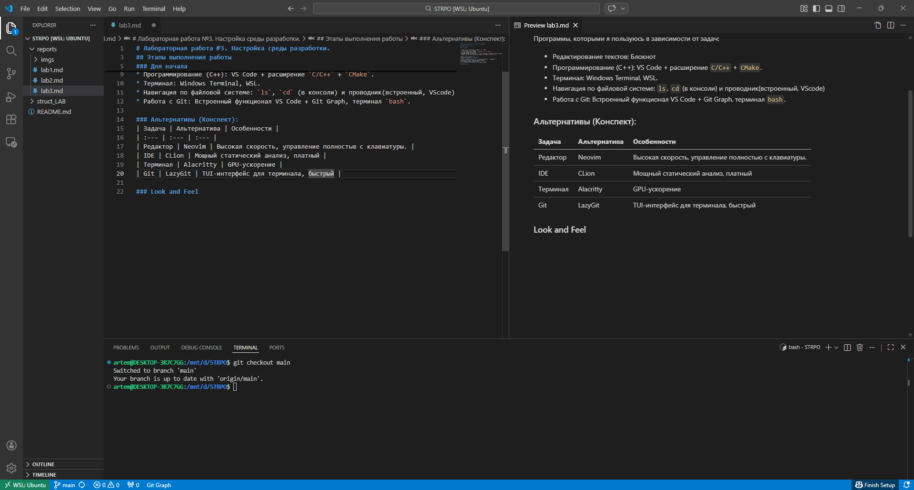
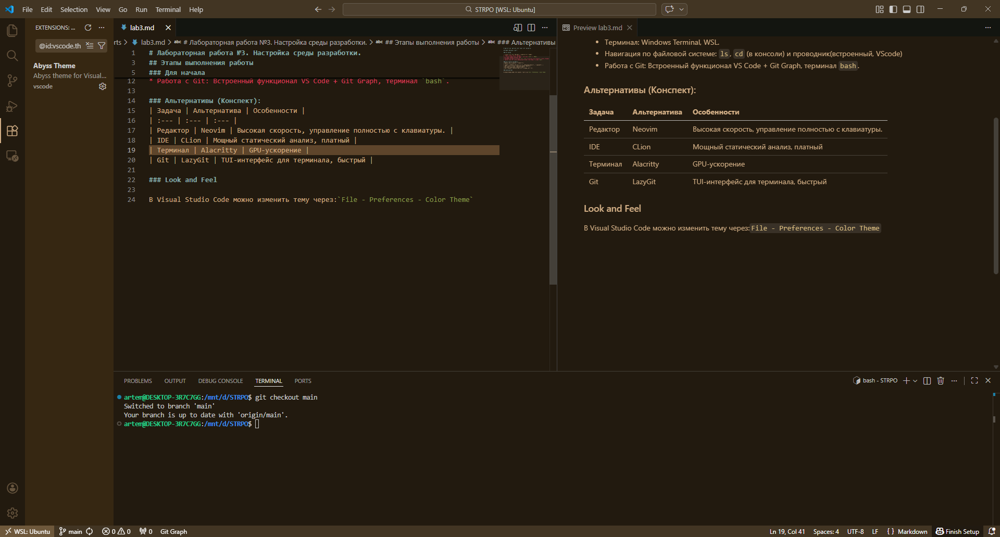

# Лабораторная работа №3. Настройка среды разработки.

## Этапы выполнения работы

### Для начала

Программы, которыми я пользуюсь в зависимости от задач:
* Редактирование текстов: Блокнот
* Программирование (C++): VS Code + расширение `C/C++` + `CMake`.
* Терминал: Windows Terminal, WSL.
* Навигация по файловой системе: `ls`, `cd` (в консоли) и проводник(встроенный, VScode)
* Работа с Git: Встроенный функционал VS Code + Git Graph, терминал `bash`.

### Альтернативы (Конспект):
| Задача | Альтернатива | Особенности |
| :--- | :--- | :--- |
| Редактор | Neovim | Высокая скорость, управление полностью с клавиатуры. |
| IDE | CLion | Мощный статический анализ, платный |
| Терминал | Alacritty | GPU-ускорение |
| Git | LazyGit | TUI-интерфейс для терминала, быстрый |

### Look and Feel

В Visual Studio Code можно изменить тему через:`File - Preferences - Color Theme`(Ctrl+K Ctrl T)

Чтобы поменять шрифт  `File - Preferences - Settings`

 
 

В VScode можно изменять расположение элементов интерфейса с помощью иконок, расположенных в верхней панели управления (Customize Layout). Можно переместить:
- Explorer
- Terminal
- Debug panel
- Extensions

В терминале WSL используется оболочка `bash`.
Приглашение ко вводу можно настроить через скрытый конфигурационный файл ~/.bashrc. `code ~/.bashrc`. 

Я изменил переменную `PS1`.
```
PS1="\[\e[32m\]\u@\h \[\e[34m\]\w \[\e[33m\]\$(git branch 2>/dev/null | grep '^*' | colrm 1 2) \$ \[\e[0m\]"
```
Теперь приглашение показывает:

- имя пользователя
- текущую директорию
- ветку git

### 3. Эргономика работы с кодом

## Полезные горячие клавиши

| Комбинация | Действие |
|---|---|
| Ctrl + Shift + P | командная палитра(открытие WSL) |
| Ctrl + P | быстро открыть файл |
| Ctrl + / | закомментировать строку |
| Alt + ↑ / ↓ | перемещение строки |
| Shift + Alt + ↓ | дублировать строку |

#### Поиск по всем файлам проекта :

```
Ctrl + Shift + F
```
#### Переход к объявлению
```
F12
```

#### Переход к реализации
```
Ctrl + F12
```

#### Найти все использования
```
Shift + F12
```
#### Переименование переменной
```
F2
```
#### Навигация по коду

Перемещение между позициями:
```
Alt + ←
Alt + →
```
#### Комментировать и раскомменировать
```
Ctrl+/ (предварительно выделить)
```
### 4. Кастомизация процессов
В VScode можно создавать свои горячие клавишы в разделе `File - Preferences - Keyboard Shortcuts`

Я настроил задачу сборки через файл:
`.vscode/tasks.json`
```
{
 "version": "2.0.0",
 "tasks": [
  {
   "label": "build",
   "type": "shell",
   "command": "make",
   "options": {
    "cwd": "${workspaceFolder}/struct_LAB/lab1"
   },
   "group": "build"
  },
  {
   "label": "run",
   "type": "shell",
   "command": "./build/lab1",
   "options": {
    "cwd": "${workspaceFolder}/struct_LAB/lab1"
   },
   "dependsOn": "build"
  },
  {
   "label": "test",
   "type": "shell",
   "command": "make test",
   "options": {
    "cwd": "${workspaceFolder}/struct_LAB/lab1"
   }
  }
 ]
}
```
Сборка происходит при `Ctrl + Shift + B`

Запуск при `Ctrl + Alt + A` 

Тесты запускаются через `Ctrl + Alt + T` настроил через файл `keybordings.json`

### 5. Интеграция с Git

В Visual Studio Code есть встроенная поддержка Git.

#### Просмотр изменений 
Вкладка `Source Control`, `Git Graph`.

#### Добавление файлов в индекс
Через интерфейс `Changes`, через терминал `git add`, через `... - chages` 

#### Коммит 
Через интерфейс - кнопка `commit`, через терминал `git commit`, через  `... - commit`

#### Добавление удаленного репозитория
Через интерфейс `Publish Repository`, терминал 
`git remote add origin https/...`

#### Получение изменений
Через `... - Pull `, через терминал `git pull`

#### Отправка изменений
Через `... - Push `, через терминал `git push`, через интерфейс - кнопка `Sync`

#### Разрешение конфликтов

Редактор предлагает кнопки:

* Accept Current
* Accept Incoming
* Accept Both