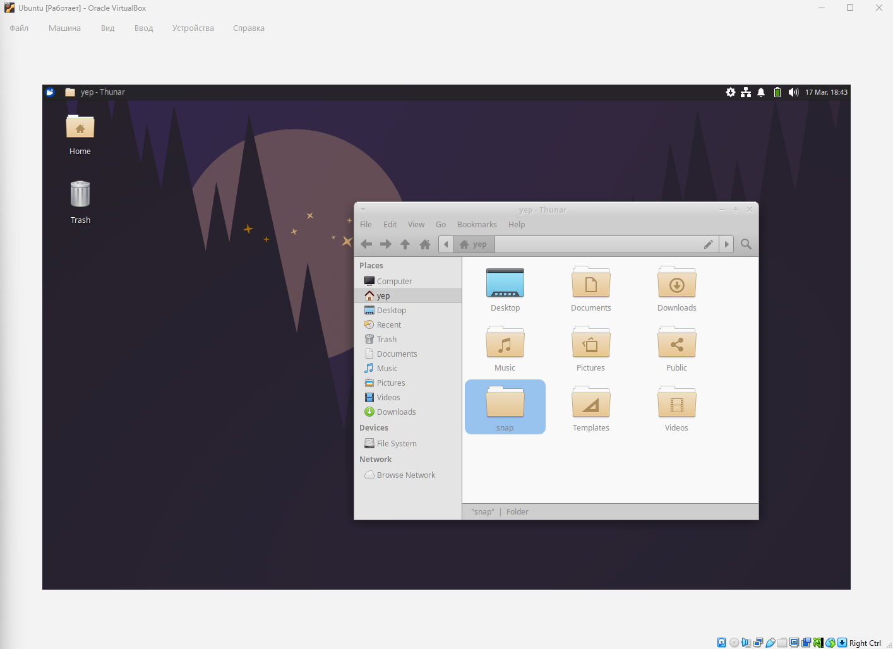
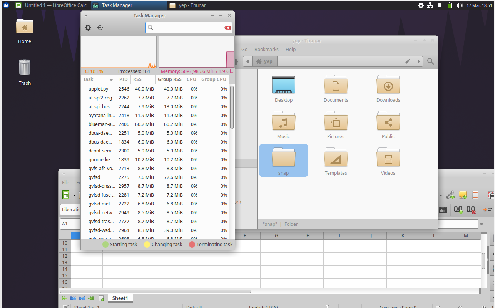

# Лабортаорная работа №4. Знакмство с Linux

### Выбор варианта 
```
echo "Эпп Артём Андреевич" | md5sum 
34235f66a234f033ae2422f101a99804  -
```
Значит мой вариант 
**Ubuntu + Xfce (Xubuntu)**

### Изучение особенностей дистрибутива
* Разработкой, поддержкой и выпуском операционной системы Ubuntu занимается британская частная компания **Canonical Ltd**. 
Xubuntu разрабатывается и поддерживается сообществом разработчиков при активной поддержке и спонсорстве той же компании.
* **Базовый дистрибутив**: Ubuntu (который, в свою очередь, основан на Debian).
* Релизы выходят каждые 6 месяцев (в апреле и октябре). Каждые 2 года выходит LTS-версия с поддержкой на 5 лет. Последний релиз _25.10_
* Ресурсы: [документация](https://docs.xubuntu.org/), [вопросы](https://askubuntu.com/), официальная Wiki Ubuntu.

#### Пакетный менеджер
Xubuntu использует систему управления пакетами APT (Advanced Package Tool) и формат пакетов .deb.
- Поиск: `apt search`

- Установка: `sudo apt install`

- Обновление списка пакетов: `sudo apt update`

- Обновление системы: `sudo apt upgrade`

- Удаление: `sudo apt remove`

Минимальные требования Xubuntu:

| Параметр | Требование |
|---|---|
| RAM | 1–2 GB |
| CPU | 1 GHz |
| Диск | 10–20 GB |
### Установка OC

Скачал образ диска Xubuntu, который сразу включает оконный менеджер Xfce.
Создал виртуальную машину, укказал ISO, установил систему. Из-за того, что выделил минимальные ресурсы для ВМ, установка заняла порядка 30 минут.



### Настройка и установка пакетов
Оконный менеджер **Xfce** позволяет:

- открывать несколько окон
- переключаться между программами

Для отслеживания ресурсов используется **Task Manager**.

Он показывает:

- загрузку CPU
- использование RAM
- процессы

Можно запустить в терминале через htop. Для этого нужно установить пакет
```
sudo apt update
sudo apt install htop

```


В системе можно:

- изменить пароль пользователя
- настроить блокировку экрана
- настроить автоматический вход

Настройки находятся в разделе: `Settings → Users`

Возможности сетевой настройки:

- подключение к Wi-Fi
- настройка Ethernet
- управление VPN

можно заупстить через bash `nmcli device status`

Файловый менеджер **Thunar** используется для работы с файлами.

Возможности:

- просмотр файлов
- копирование
- перемещение
- удаление

Для работы в интернете используется браузер **Firefox**.

Были установлены инструменты разработки.

Компилятор GCC
```
sudo apt install build-essential
```
Отладчик
```
sudo apt install gdb
```

в качестве редактора кода установил VScode
```
sudo snap install --classic code
```
