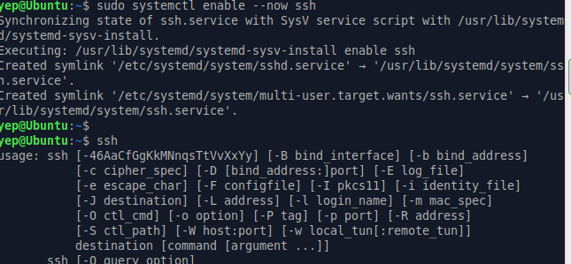
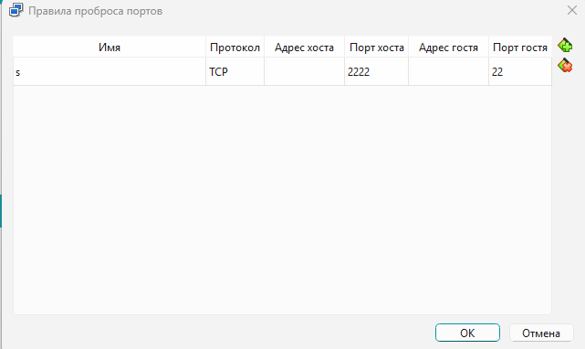
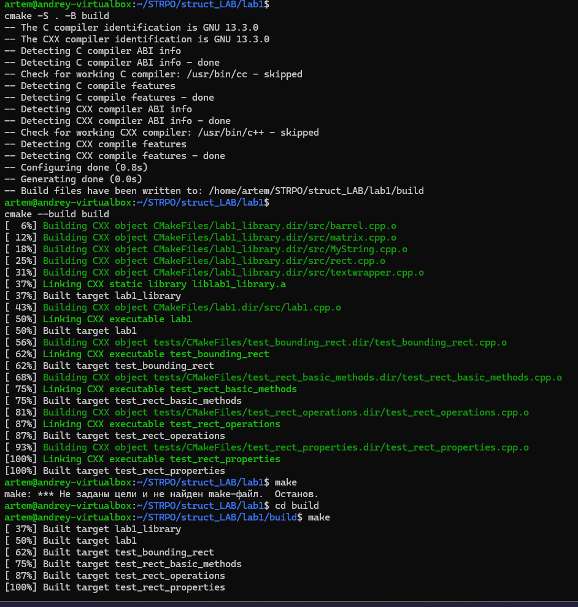
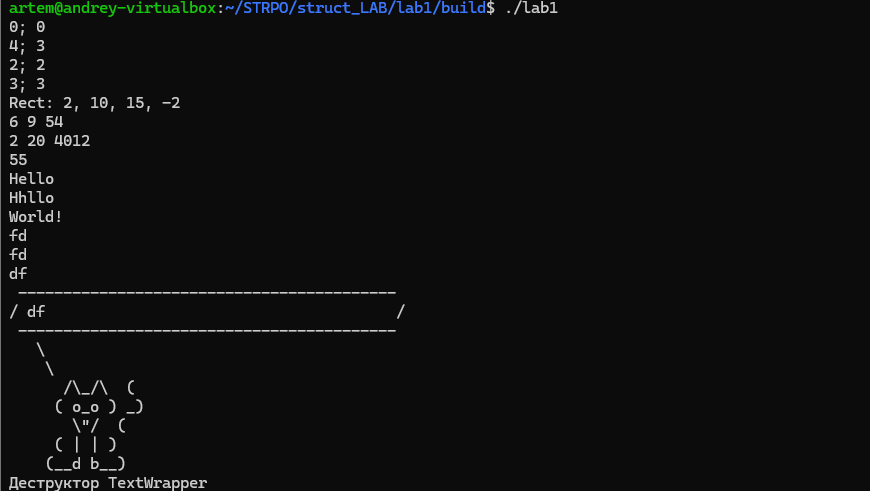

# Лабораторная работа №7. Развертывание на целевой машине.

## Этапы выполнения работы

### Создание виртуальной машины
Я использую **Ubuntu + Xfce (Xubuntu)*

Платформа: VirtualBox

При предоставлении доступа внешнему пользователю существует риск несанкционированного доступа к личным файлам в домашней директории, перехвата трафика или использования ресурсов ЦП для сторонних задач. 

### Настройка удаленного доступа
Выполнена установка пакета openssh-server
```
sudo apt update
sudo apt install openssh-server
```
Служба добавлена в автозагрузку: ` sudo systemctl enable --now ssh. `



**Порт TCP** — это числовой идентификатор (от 0 до 65535), который используется для маршрутизации данных внутри одного компьютера . Он указывает, какому именно приложению или процессу нужно доставить сетевой пакет

**Проброс портов** — это технология перенаправления входящего сетевого трафика с внешнего IP-адреса маршрутизатора на конкретный компьютер во внутренней локальной сети.

Проброс портов:
Настройки ВМ - Сеть  - Дополнительно - Проброс портов
Host Port: 2222, Guest Port: 22


Подключение: 
` ssh yep@127.0.0.1 -p 2222 `
Подключились к виртуалке.
```
ssh yep@127.0.0.1 -p 2222
yep@127.0.0.1's password:
Welcome to Ubuntu 25.10 (GNU/Linux 6.17.0-19-generic x86_64)

 * Documentation:  https://docs.ubuntu.com
 * Management:     https://landscape.canonical.com
 * Support:        https://ubuntu.com/pro

165 updates can be applied immediately.
60 of these updates are standard security updates.
To see these additional updates run: apt list --upgradable
```

Добавление публичного ключа для подключения на сервер:
- Если ключа еще нет, то на хосте: `ssh-keygen -t ed25519`
- скопировать ключ 
```
yep@Ubuntu:~$
mkdir -p ~/.ssh
chmod 700 ~/.ssh(изменить права доступа)
nano ~/.ssh/authorized_keys
```
- вставить скопированную строку с ключом

Попробовал подключиться без пароля:
```
PS C:\Users\Артём> ssh yep@127.0.0.1 -p 2222
Welcome to Ubuntu 25.10 (GNU/Linux 6.17.0-19-generic x86_64)

 * Documentation:  https://docs.ubuntu.com
 * Management:     https://landscape.canonical.com
 * Support:        https://ubuntu.com/pro

165 updates can be applied immediately.
60 of these updates are standard security updates.
To see these additional updates run: apt list --upgradable

Last login: Wed Apr 15 18:47:29 2026 from 10.0.2.2
yep@Ubuntu:~$
```
Отключил доступ по паролю. 
`sudo nano /etc/ssh/sshd_config`
Изменил параметр PasswordAuthentication на no.

### Настройка сессии для другого пользователя

Создание пользователя: Создан новый пользователь для напарника: `sudo adduser partner`. Учетная запись получила свою домашнюю директорию `/home/partner`

Публичный ключ, полученный от напарника, добавлен в `/home/partner/.ssh/authorized_keys.`
```
sudo nano /home/partner/.ssh/authorized_keys
```

Локальная сеть: Компьютеры помещены в одну Wi-Fi сеть. 
Получил ip через `ipconfig`

`ping 192.168.31.8`

```
 ping 192.168.31.121

Обмен пакетами с 192.168.31.121 по с 32 байтами данных:
Превышен интервал ожидания для запроса.
Превышен интервал ожидания для запроса.
Превышен интервал ожидания для запроса.
Превышен интервал ожидания для запроса.

Статистика Ping для 192.168.31.121:
    Пакетов: отправлено = 4, получено = 0, потеряно = 4
    (100% потерь)
PS C:\Users\Артём> ping 192.168.31.121

Обмен пакетами с 192.168.31.121 по с 32 байтами данных:
Ответ от 192.168.31.121: число байт=32 время=3мс TTL=128
Ответ от 192.168.31.121: число байт=32 время=6мс TTL=128
Ответ от 192.168.31.121: число байт=32 время=21мс TTL=128
Ответ от 192.168.31.121: число байт=32 время=7мс TTL=128

Статистика Ping для 192.168.31.121:
    Пакетов: отправлено = 4, получено = 4, потеряно = 0
    (0% потерь)
Приблизительное время приема-передачи в мс:
    Минимальное = 3мсек, Максимальное = 21 мсек, Среднее = 9 мсек
```

напарник открыл порт 2222 для подключений через брандмауэр
```
ssh artem@192.168.31.121 -p 2222
Welcome to KDE neon User Edition (GNU/Linux 6.17.0-20-generic x86_64)

Расширенное поддержание безопасности (ESM) для Applications выключено.

16 обновлений может быть применено немедленно.
12 из этих обновлений, являются стандартными обновлениями безопасности.
Чтобы просмотреть дополнительные обновления выполните: apt list --upgradable

Включите ESM Apps для получения дополнительных будущих обновлений безопасности.
Смотрите https://ubuntu.com/esm или выполните: sudo pro status

Failed to connect to https://releases.neon.kde.org/meta-release-lts. Check your Internet connection or proxy settings


The programs included with the KDE neon system are free software;
the exact distribution terms for each program are described in the
individual files in /usr/share/doc/*/copyright.

KDE neon comes with ABSOLUTELY NO WARRANTY, to the extent permitted by
applicable law.
```
### Развертование программы

Чтобы собрать проект, на машине должны стоять:

Git: Для клонирования репозитория.

Компилятор (GCC/G++): Для превращения исходного кода в исполняемый файл.

Система сборки (CMake): Скорее всего, твой проект использует её для управления процессом компиляции.

Подключился к машине `ssh artem@192.168.31.121 -p 2222`

Установил необходимые зависимости:
```
sudo apt update
sudo apt install -y git build-essential cmake gdb
```
склонировал репозиторий `git clone https://github.com/Artemka19777/STRPO `

собра проект


запустил


Удалил правило для безопасности 